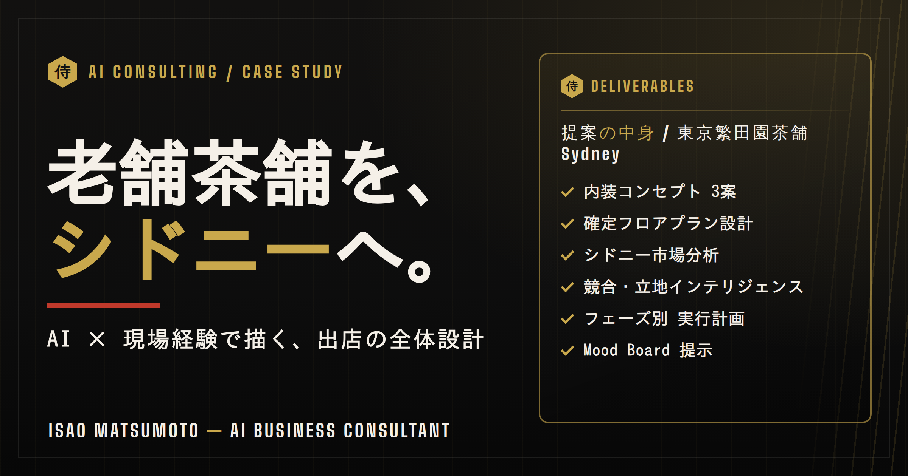

# AI Business Consulting Case Study — 老舗茶舗のシドニー出店

**AI × 27年の現場経験で描く、出店の全体設計。内装コンセプトから確定フロアプラン・市場分析・実行計画まで。**

> 🏮 **上位ページ（飲食業向けAIコンサル 概要）**: [hospitality-ai-consulting.html](https://isao1301111-eng.github.io/portfolio-tea-shop-ai-consulting/hospitality-ai-consulting.html) — 日本茶専門店（実クライアント）＋日本食レストラン（事業設計）の2事例を方法論として提示。本ケーススタディ（お茶屋）はその「事例A」の詳細版です。

---

## 🎯 概要 / Overview

**[日本語]**
シドニー・Surry Hills への出店を計画する老舗日本茶舗に向けて作成した、**AIビジネスコンサルティングの提案事例（ポートフォリオ）**です。単なるアイデア出しではなく、**確定フロアプランに基づく内装設計・市場分析・段階的な実行計画**までを、AIと建築塗装27年の現場知識を組み合わせて描いています。

**[English]**
An AI business consulting case study for a long-established Japanese tea house planning a store in Surry Hills, Sydney. It goes beyond ideas — pairing AI with 27 years of hands-on construction experience to deliver interior design concepts grounded in a confirmed floor plan, market intelligence, and a phased execution plan.

---

## 📦 提案の中身 / What's Inside

| 項目 | 内容 |
|---|---|
| 内装コンセプト 3案 | 「青碧の間（Blue & Timber Modern）」「静寂の石と木（Wabi-Sabi）」「青侘び（Blue Wabi-Sabi Hybrid）」 |
| 確定フロアプラン設計 | ゾーニング（ワークショップ動線・試飲・小売・デモカウンター）。NSW Heritage 規制・FRL耐火壁など現場条件を反映 |
| シドニー市場分析 | 日本茶市場の空白・競合（抹茶カフェ）との差別化・立地インテリジェンス |
| フェーズ別 実行計画 | 業者打合せに合わせた優先順位と段取り |
| Mood Board | 意思決定を後押しするビジュアル提示 |

`proposal_mariko.pdf`（全8ページの提案書）と、コンセプト画像（concept-a/b/c）を同梱。

---

## 💡 ポジショニング / Why This Matters

このケーススタディは、**「ドメイン知識 × AI」で顧客の事業を実際に設計できる**ことを示すものです。図面が読め、施工条件（耐火・遺産保護規制・動線）を理解したうえで、AIで市場・デザイン・計画を高速に構築する——現場を知るコンサルタントだからこそ出せる提案です。

---

## 👤 作者 / Author

**松本 勲（Isao Matsumoto）** — AI Business Consultant / AI Automation Developer
建築塗装27年（日豪で自営業 通算約10年）× AI。2026年9月21日 関東へ帰国予定。

- Email: isao1301111@gmail.com
- LinkedIn: [linkedin.com/in/isao-matsumoto-1b271411b](https://linkedin.com/in/isao-matsumoto-1b271411b)

### 関連プロジェクト
- [samurai-painting-quote](https://github.com/isao1301111-eng/samurai-painting-quote) — AI見積もりツール（13項目ハルシネーション防止）
- [genba-nippo-tool](https://github.com/isao1301111-eng/genba-nippo-tool) — 打ち込みゼロ 現場日報ツール
